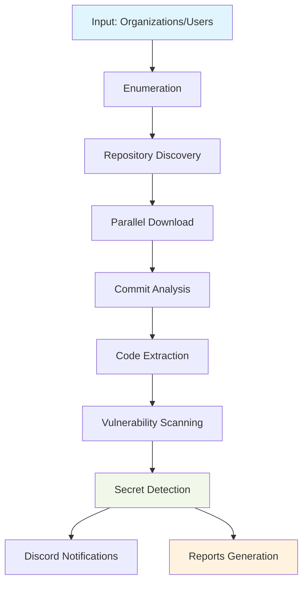

*How security researchers are uncovering exposed secrets at scale*

---

## The Hidden Dangers in Your GitHub Footprint

In today's development landscape, GitHub repositories have become the modern treasure maps for attackers. What starts as an innocent commit can quickly turn into a major security incident when sensitive information like API keys, database credentials, or private certificates accidentally gets pushed to public repositories.

Traditional security scanning approaches often fail because they're:
- **Fragmented** - Multiple tools for different parts of the process
- **Time-consuming** - Manual effort that takes days instead of minutes  
- **Incomplete** - Missing repositories from organization members
- **Reactive** - Finding leaks after they've been exploited

Enter **GitRepoEnum** - a comprehensive Go-based tool that's transforming how security teams approach GitHub leak detection.

## What is GitRepoEnum?

GitRepoEnum is an all-in-one reconnaissance tool designed for security researchers, bug bounty hunters, and DevOps teams to systematically enumerate, download, and analyze GitHub repositories for potential security vulnerabilities.

### 🚀 Key Capabilities

- **🔍 Multi-Source Enumeration** - Discover repositories from organizations, users, and their members
- **⚡ Parallel Processing** - High-speed cloning with configurable parallelism
- **📅 Time-Based Filtering** - Focus on recent changes with flexible date ranges
- **🔐 Secret Detection** - Integrated TruffleHog scanning for credential leaks
- **📱 Smart Notifications** - Discord integration for real-time alerts
- **🛠️ Custom Workflows** - Modular commands for tailored reconnaissance

## Installation Made Simple

### Prerequisites

```bash
# Install TruffleHog for secret scanning
git clone https://github.com/trufflesecurity/trufflehog.git
cd trufflehog && go install

# Install Notify for Discord notifications
go install -v github.com/projectdiscovery/notify/cmd/notify@latest
```

### Installation Methods

**Method 1: Go Install (Recommended)**
```bash
go install github.com/rix4uni/gitrepoenum@latest
```

**Method 2: Prebuilt Binaries**
```bash
wget https://github.com/rix4uni/gitrepoenum/releases/download/v0.0.2/gitrepoenum-linux-amd64-0.0.2.tgz
tar -xvzf gitrepoenum-linux-amd64-0.0.2.tgz
mv gitrepoenum ~/go/bin/gitrepoenum
```

**Method 3: Source Compilation**
```bash
git clone --depth 1 https://github.com/rix4uni/gitrepoenum.git
cd gitrepoenum && go install
```

### Configuration Setup

```bash
# Create config directory
mkdir -p ~/.config/gitrepoenum

# Add GitHub tokens (one per line)
echo "ghp_yourtoken1" >> ~/.config/gitrepoenum/github-token.txt
echo "ghp_yourtoken2" >> ~/.config/gitrepoenum/github-token.txt
```

Create `~/.config/gitrepoenum/config.yaml`:
```yaml
github:
  tokens:
    - "ghp_yourtoken1"
    - "ghp_yourtoken2"
  
download:
  base_dir: "~/allgithubrepo"
  parallel: 15
  depth: 10

scanning:
  trufflehog:
    enabled: true
    verify: false
```

## Core Features Deep Dive

### 1. Multi-Source Repository Enumeration

**Organization Reconnaissance**
```bash
echo "google" | gitrepoenum org --output google-repos.json
```

**Member Discovery** 
```bash
echo "microsoft" | gitrepoenum member --output ms-members.json
```

**User Enumeration**
```bash
echo "torvalds" | gitrepoenum user --output linus-repos.json
```

### 2. Intelligent Date Filtering

Focus your scanning on recent changes to save time and resources:

```bash
# Last 24 hours
echo "shopify" | gitrepoenum org --date 24h

# Last 7 days  
echo "netflix" | gitrepoenum org --date 7d

# Last 30 days
echo "airbnb" | gitrepoenum org --date 30d

# All time (default)
echo "facebook" | gitrepoenum org --date all
```

**Supported time units:**
- `s` - seconds
- `m` - minutes
- `h` - hours  
- `d` - days
- `w` - weeks
- `M` - months
- `y` - years

### 3. Advanced Repository Download

**Parallel Cloning for Speed**
```bash
cat repos.txt | gitrepoenum download --parallel 20 --depth 10
```

**Key parameters:**
- `--parallel`: Number of simultaneous clones (default: 10)
- `--depth`: Git history depth (default: 5, 0 for full history)
- `--output-directory`: Custom download location

### 4. Comprehensive Commit Analysis

**Extract Recent Commits**
```bash
gitrepoenum commit --input ./download --date 7d --output ./commits
```

**Code Change Extraction**
```bash
gitrepoenum code --input ./download --output ./commits
```

### 5. Vulnerability Scanning with TruffleHog

```bash
gitrepoenum vuln --input ./commits --output ./vulnerabilities
```

Detects:
- **API keys** (AWS, Google Cloud, Azure, etc.)
- **Database credentials** (MySQL, PostgreSQL, MongoDB)  
- **Private keys** (RSA, DSA, EC)
- **OAuth tokens**
- **Cloud service credentials**
- **Cryptocurrency keys**

## The Power of leaksmoniter: Complete Automation

The `leaksmoniter` command represents GitRepoEnum's most powerful feature - complete workflow automation in a single command.

### Complete Security Assessment Pipeline

```bash
echo "target-company" | gitrepoenum leaksmoniter \
  --scan-repo org,member \
  --date 7d \
  --parallel 15 \
  --depth 10 \
  --notifyid vuln-alerts \
  --download-dir ./scans
```

This single command executes:
1. **Enumeration** - Fetches organization and member repositories
2. **Filtering** - Focuses on repositories updated in last 7 days  
3. **Cloning** - Downloads repositories with 15 parallel workers
4. **Analysis** - Extracts commits and code changes
5. **Scanning** - Runs TruffleHog vulnerability detection
6. **Notification** - Sends verified findings to Discord

### Advanced LeaksMonitor Scenarios

**Large Organization Assessment**
```bash
cat fortune-500.txt | gitrepoenum leaksmoniter \
  --scan-repo org,member \
  --date 30d \
  --parallel 25 \
  --depth 5 \
  --notifyid enterprise-scans
```

**Continuous Monitoring Setup**
```bash
# Daily monitoring script
echo "my-company" | gitrepoenum leaksmoniter \
  --scan-repo org,member,user \
  --date 1d \
  --parallel 10 \
  --notifyid daily-monitoring
```

**Incident Response**
```bash
# Focus on very recent changes
echo "compromised-org" | gitrepoenum leaksmoniter \
  --scan-repo org,member \
  --date 2h \
  --parallel 20 \
  --depth 0 \
  --notifyid incident-response
```

## Real-World Use Cases

### 1. External Attack Surface Mapping

**Scenario**: Security team needs to understand their organization's GitHub footprint.

```bash
echo $COMPANY_NAME | gitrepoenum leaksmoniter \
  --scan-repo org,member \
  --date all \
  --parallel 20 \
  --notifyid external-surface
```

**Benefits**:
- Discover all organization repositories
- Identify employee repositories containing company code
- Assess exposure of sensitive information
- Establish baseline for continuous monitoring

### 2. Third-Party Risk Assessment

**Scenario**: Evaluate security posture of vendors and partners.

```bash
cat vendors.txt | gitrepoenum leaksmoniter \
  --scan-repo org \
  --date 90d \
  --parallel 15 \
  --notifyid third-party-risk
```

### 3. Acquisition Due Diligence

**Scenario**: Technical due diligence for company acquisitions.

```bash
echo $TARGET_COMPANY | gitrepoenum leaksmoniter \
  --scan-repo org,member,user \
  --date all \
  --parallel 25 \
  --depth 0
```

### 4. Red Team Operations

**Scenario**: External penetration testing with limited initial access.

```bash
cat target-companies.txt | gitrepoenum leaksmoniter \
  --scan-repo org,member \
  --date 30d \
  --parallel 10 \
  --notifyid redteam-findings
```

## Workflow Visualization



## Output Structure

```
~/allgithubrepo/
├── download/          # Cloned repositories
├── commits/           # Extracted commit logs  
├── code/             # Code from specific commits
└── vulnerabilities/  # TruffleHog scan results
```

## Advanced Configuration and Optimization

### Token Rotation Strategy

Maximize API rate limits with multiple tokens:

```bash
# Create token file with multiple tokens
echo "ghp_token1
ghp_token2
ghp_token3
ghp_token4
ghp_token5" > ~/.config/gitrepoenum/github-token.txt
```

### Performance Tuning

**Memory Optimization**
```bash
GOGC=50 gitrepoenum leaksmoniter [options]
```

**Network Optimization**
```bash
git config --global http.postBuffer 524288000
git config --global http.lowSpeedLimit 0
git config --global http.lowSpeedTime 999999
```

## Integration with Security Ecosystems

### CI/CD Pipeline Integration

```yaml
# GitHub Actions example
name: Daily GitHub Leak Scan
on:
  schedule:
    - cron: '0 2 * * *'  # 2 AM daily

jobs:
  leak-scan:
    runs-on: ubuntu-latest
    steps:
      - uses: actions/checkout@v3
      - name: Install gitrepoenum
        run: go install github.com/rix4uni/gitrepoenum@latest
      - name: Run leak monitoring
        run: |
          echo "${{ secrets.TARGET_ORG }}" | gitrepoenum leaksmoniter \
            --scan-repo org,member \
            --date 1d \
            --notifyid ${{ secrets.DISCORD_WEBHOOK }}
```

### SIEM Integration

Process findings through your security information system:

```bash
# Export findings for SIEM ingestion
find ~/.gitrepoenum/vuln -name "trufflehog.json" -exec cat {} \; | \
jq -r 'select(.Verified==true) | .Raw' > vulnerabilities.txt
```

## Troubleshooting Common Issues

### Rate Limiting Problems

**Symptoms**: HTTP 403 errors, incomplete data

**Solutions**:
- Add more GitHub tokens
- Increase delay between requests
- Use fine-grained personal access tokens

```bash
# Increased delay for rate limit compliance
echo "large-org" | gitrepoenum leaksmoniter --delay 100ms
```

### Network and Clone Failures

**Symptoms**: Intermittent clone failures, timeout errors

**Solutions**:
- Reduce parallel workers
- Increase Git timeouts
- Use shallow cloning

```bash
# Conservative settings for unstable networks
cat repos.txt | gitrepoenum download --parallel 5 --depth 1
```

## Ethical Considerations and Best Practices

### Responsible Disclosure

When discovering vulnerabilities in third-party code:

1. **Verify ownership** of the exposed resources
2. **Use official channels** for disclosure
3. **Provide clear reproduction steps**
4. **Allow reasonable time** for remediation
5. **Avoid data exfiltration** during testing

### Legal Compliance

- Ensure proper authorization for all assessments
- Respect GitHub's Terms of Service
- Follow responsible vulnerability disclosure protocols
- Obtain written permission for third-party assessments

## The Future of GitRepoEnum

The project continues to evolve with planned enhancements:

### Short-term Goals
- Support for GitLab and Bitbucket
- Enhanced pattern matching for custom secrets
- Improved error handling and retry logic
- Additional notification channels (Slack, Teams, Email)

### Medium-term Vision
- Machine learning for false positive reduction
- Historical trend analysis
- Integration with secret management systems
- Automated remediation suggestions

## Conclusion

GitRepoEnum represents a paradigm shift in GitHub security monitoring, transforming what was once a manual, fragmented process into a streamlined, comprehensive workflow. By combining powerful enumeration capabilities with intelligent filtering and advanced vulnerability detection, it empowers security teams to proactively identify and address information leaks before they can be exploited.

### Key Takeaways

1. **Comprehensive Coverage** - From organization repositories to member and user code
2. **Time Efficiency** - Days of manual effort reduced to minutes of automation
3. **Scalable Architecture** - Built to handle organizations of all sizes
4. **Actionable Intelligence** - Focus on verified vulnerabilities with real-time notifications
5. **Continuous Improvement** - Regular updates ensure evolution with the threat landscape

### Getting Started

Begin your GitHub security journey today:

```bash
# Install the tool
go install github.com/rix4uni/gitrepoenum@latest

# Run your first assessment  
echo "your-organization" | gitrepoenum leaksmoniter --scan-repo org
```

### Join the Community

Contribute to the project and help improve GitHub security for everyone:

- **GitHub Repository**: [github.com/rix4uni/gitrepoenum](https://github.com/rix4uni/gitrepoenum)
- **Issue Tracking**: Report bugs and request features
- **Contributions**: Pull requests welcome for new detectors and enhancements

In an era where source code repositories have become critical assets, tools like GitRepoEnum are no longer optional - they're essential components of modern security programs. By automating the discovery of exposed secrets and credentials, organizations can significantly reduce their attack surface and protect their most valuable digital assets.

---

*This guide covers the comprehensive capabilities of GitRepoEnum for automated GitHub security monitoring. Always ensure proper authorization before conducting security assessments and follow responsible disclosure practices when identifying vulnerabilities.*

**⭐ If you found this guide helpful, don't forget to star the [GitRepoEnum repository](https://github.com/rix4uni/gitrepoenum) on GitHub!**